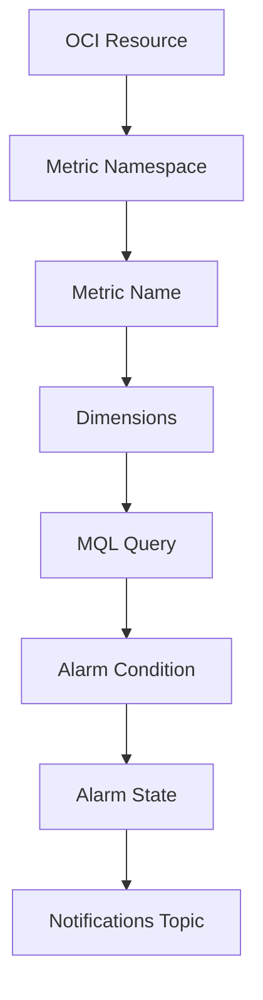
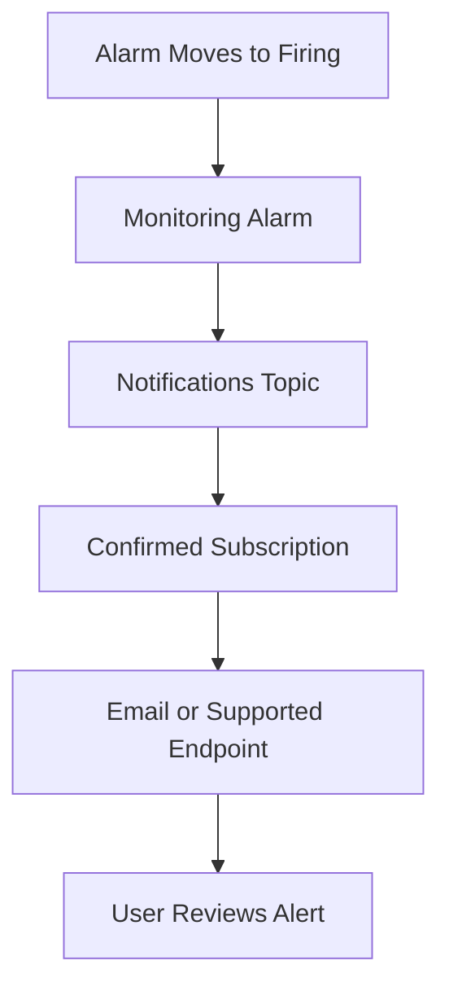

# OCI Monitoring Alarm and Notification Flow

## Overview

This repository explains how OCI Monitoring alarms and OCI Notifications work together.
It covers the basic flow from a resource metric to an alarm condition, and then from the alarm to a notification topic and subscription.

The focus is simple:

- Review the metric
- Understand the namespace and dimensions
- Define the alarm query
- Connect the alarm to a notification topic
- Confirm the subscription
- Review the alert when it is received

No confidential information, tenancy details, OCIDs, real email addresses, or project-specific information is included.

---

## Why I Created This

Monitoring should not stop at viewing a chart.
A useful alerting setup needs a complete flow. The metric should be clear. The alarm condition should make sense. The notification topic should be connected. The subscription should be confirmed.
This repository keeps that flow simple and easy to understand.

---

## Product Used

Oracle Cloud Infrastructure Monitoring and Notifications

---

## Monitoring Alarm Flow

---

## Notification Delivery Flow

---

## Components Covered

This repository covers the following OCI areas:

- Monitoring
- Metrics
- Metric namespaces
- Metric dimensions
- MQL query
- Alarm condition
- Alarm severity
- Notifications topic
- Subscription
- Basic alert review flow

---

## What I Understood

My main understanding is that monitoring is not only about checking metric charts.
A useful monitoring setup needs the metric, query, alarm, notification topic, and subscription to work together.
The metric shows what is happening. The query defines what should be checked. The alarm decides when attention is needed. The notification topic and subscription help send the message to the right place.
If one part is missing, the alerting flow may not work properly.

---
## Clean Usage Note

This repository uses simple sample names and diagrams only.
It does not include copied diagrams, screenshots, tenancy details, OCIDs, real notification topics, real email addresses, or project-specific information.
