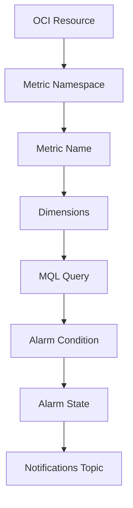

# Monitoring Alarm Flow

This diagram shows a simple OCI Monitoring alarm flow.

An alarm is not created only by selecting a resource.
A useful alarm needs the right metric namespace, metric name, dimensions, query, threshold, and notification destination.

---

## What I Understood

My main understanding is that an alarm should be tied to a clear monitoring need.
The query should be simple enough to understand. The threshold should match the monitoring need. The notification destination should be reviewed before depending on the alarm.
