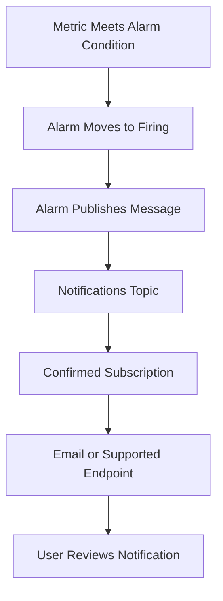

# Notification Delivery Flow

This diagram shows how an OCI Monitoring alarm can send a message through OCI Notifications.

The main point is that an alarm message must have a delivery path.
The Notifications topic is the message channel. The subscription is the endpoint that receives the message.

---

## What I Understood

My main understanding is that creating an alarm is not enough.
The notification flow should also be checked. If the topic is missing, or the subscription is not confirmed, the alert may not reach the right person.
