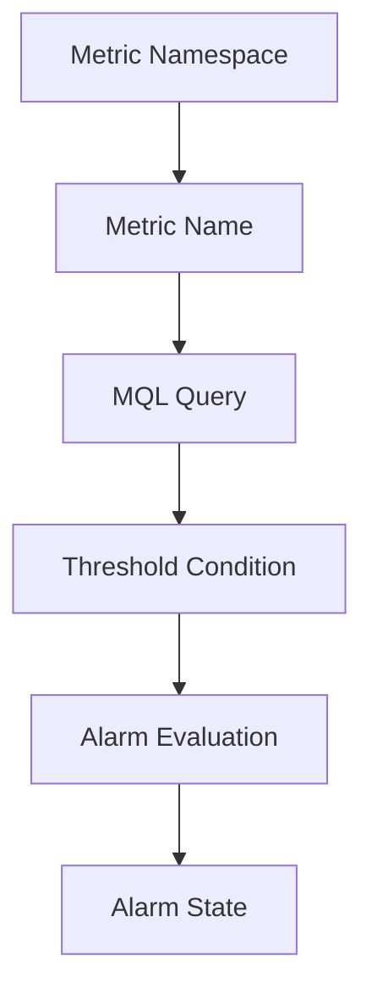

# Alarm Query and Trigger

## Overview

An OCI Monitoring alarm evaluates a metric query.
The query defines which metric is being checked and what condition should trigger the alarm.
Monitoring Query Language is used to define metric queries for alarms.

---

## Basic Alarm Flow



---

## Sample MQL Query

This is a simple sample query for CPU utilization:

```text
CpuUtilization[5m].mean() > 80
```

This means the alarm condition is based on average CPU utilization over a five-minute interval.
The threshold should be selected based on the resource and monitoring need.

---

## Alarm Trigger

An alarm can move to a firing state when the metric result meets the condition defined in the query.
For example, if CPU utilization stays above the selected threshold, the alarm can trigger and publish a message to the configured notification topic.

---

## Review Points

Before depending on an alarm, these points should be checked:

- Correct metric namespace
- Correct metric name
- Correct compartment
- Correct resource or dimension
- Correct threshold
- Correct evaluation interval
- Correct notification destination

---

## What I Understood

My main understanding is that an alarm is only useful when the query is clear.
A very broad query can create noise. A very narrow query can miss important conditions.
The alarm should match the actual monitoring need.
