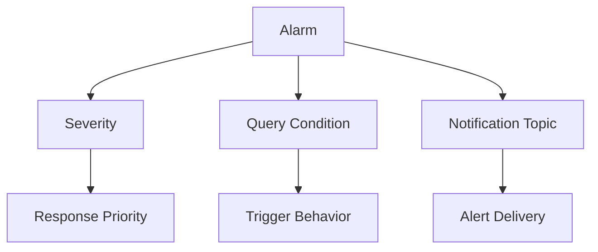

# Alarm Severity and Review

## Overview

Alarm severity helps show the importance of an alarm.
Severity should match the response needed when the alarm fires.

---

## Alarm Severity

Common severity examples include:

```text
CRITICAL
ERROR
WARNING
INFO
```

The selected severity should match the actual impact.

A critical alarm should be used for something that needs quick attention. A warning can be used when the condition needs review but may not be immediately severe.

---

## Why Severity Matters

If every alarm is marked critical, users may stop paying attention.
If important alarms are marked too low, the issue may not get enough attention.
Severity should be selected based on impact and response need.

---

## Alarm Review

Before relying on an alarm, the setup should be reviewed end to end.

The review should include:

- Metric selected
- Query condition
- Threshold
- Evaluation interval
- Severity
- Notification topic
- Subscription confirmation
- Alert message clarity

---

## Simple Flow



---

## What I Understood

My main understanding is that alert quality matters.
An alarm should not only fire. It should also be understandable and useful.
Severity helps with priority. The notification path helps with visibility. The query and threshold decide whether the alarm is meaningful.
