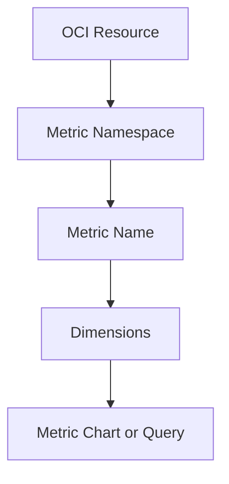

# Metrics and Namespaces

## Overview

OCI Monitoring uses metrics to show what is happening with cloud resources.
A metric belongs to a namespace. The namespace helps identify which OCI service or resource area is producing the metric.

---

## Metric Namespace

A metric namespace groups related metrics.
Example namespace, if compute monitoring is enabled:

```text
oci_computeagent
```

This namespace can be used for compute instance monitoring metrics when the required compute monitoring setup is available.

---

## Metric Name

A metric name identifies the specific measurement being reviewed.

Example:

```text
CpuUtilization
```

This metric can help review CPU activity for a compute instance.

---

## Dimensions

Dimensions provide more detail for a metric.
They help narrow the metric stream to a specific resource or condition, depending on the service and metric type.
Examples can include resource identifiers or other values related to the metric.

---

## Simple Flow



---

## Review Points

Before creating an alarm, these points should be checked:

- Correct compartment
- Correct metric namespace
- Correct metric name
- Correct dimensions
- Correct time range
- Whether the metric chart is showing expected data

---

## What I Understood

My main understanding is that a metric chart is the starting point for an alarm.
If the wrong namespace, metric, or dimension is selected, the alarm may not represent the resource correctly.
Before creating an alarm, the metric should be reviewed first.
