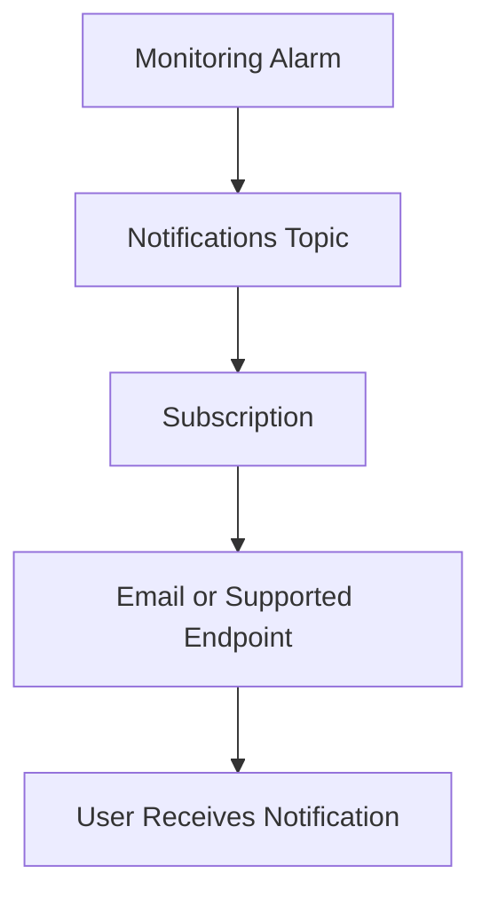

# Notification Topic and Subscription

## Overview

OCI Notifications is used to send messages from services such as Monitoring alarms.
A topic is the message channel.
A subscription is the endpoint that receives messages from the topic.

---

## Notification Flow



---

## Topic

A topic is used as the destination for alarm messages.
An alarm can publish a message to the topic when the alarm condition is met.
The topic name should be clear so users can understand its purpose.

Sample topic name:

```text
Demo-Operations-Alerts
```

---

## Subscription

A subscription defines where the message should be delivered.

Examples of subscription endpoints can include:

- Email
- HTTPS endpoint
- Function
- Other supported endpoints, depending on the setup

For email subscriptions, the subscription must be confirmed before messages can be delivered.

---

## Why Confirmation Matters

Creating an email subscription does not always mean alerts will be received immediately.
The email subscription must be confirmed from the recipient side.
If the subscription is not confirmed, the notification flow may not work as expected.

---

## Review Points

Before depending on notifications, these points should be checked:

- Topic exists
- Topic is selected in the alarm
- Subscription is created
- Email subscription is confirmed
- Notification destination is correct
- No real email address is exposed in public documentation

---

## What I Understood

My main understanding is that an alarm needs a working delivery path.
The alarm may detect the issue, but the Notifications topic and subscription help make sure the message reaches someone.
Both parts should be reviewed together.
